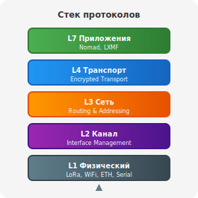
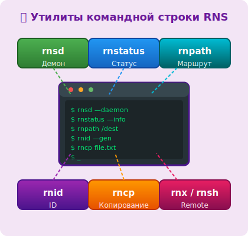
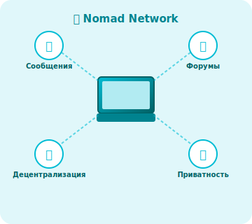
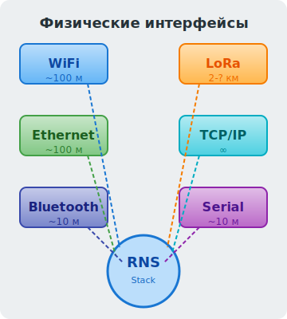

# 🌐 Документация Reticulum Network Stack

**Reticulum** — это криптографически защищённый сетевой стек для создания сетей любой топологии на любом физическом носителе.

[:material-github: Git репозиторий документации](https://github.com/kirillz/reticulum-docs){ .md-button .md-button--primary }

---

## 🚀 Быстрый старт

-   { loading=lazy width="280" class="diagram-svg" }

    :material-router-wireless: **[RNS — основы стека](rns/index.md)**

    Архитектура, адресация, маршрутизация и транспортный уровень

-   { loading=lazy width="280" class="diagram-svg" }

    :material-book-open-page-variant: **[Словарь терминов](rns/glossary.md)**

    Ключевые понятия для понимания работы сети Reticulum

-   { loading=lazy width="280" class="diagram-svg" }

    :material-console: **[Утилиты командной строки](rns/tools/index.md)**

    Диагностика, передача файлов, удалённое выполнение

-   { loading=lazy width="280" class="diagram-svg" }

    :material-message: **[LXMF — сообщения](lxmf/index.md)**

    Протокол обмена сообщениями поверх RNS

-   { loading=lazy width="280" class="diagram-svg" }

    :material-laptop: **[Nomad Network](nomadnet/index.md)**

    Клиент для общения в децентрализованной сети

-   { loading=lazy width="280" class="diagram-svg" }

    :material-chip: **[Оборудование](rns/hardware.md)**

    Поддерживаемые устройства и настройки

---

## 🤝 Участие в проекте

Эта документация поддерживается сообществом. Вы можете помочь:

- :material-bug: Сообщить об ошибке перевода
- :material-pencil: Добавить недостающий раздел
- :material-translate: Улучшить существующие материалы
- :material-lightbulb: Предложить примеры использования

[:material-github: Внести свой вклад в документы](https://github.com/kirillz/reticulum-docs){ .md-button .md-button--primary }

<!-- Announcement Banner

  ⚠️
  

    <a href="https://t.me/reticulum_network_rus/9/9290" target="_blank" rel="noopener">
      <strong>Внимание Meshcore!(возможно фейк)</strong>
    </a>
  

  <button class="announcement-banner__close" type="button" aria-label="Закрыть" onclick="closeMeshcoreBanner()">×</button>

 End Announcement Banner -->

---

## 📖 Дополнительные ресурсы

- [Официальная документация Reticulum](https://reticulum.network/docs/)
- [Исходный код Reticulum](https://github.com/markqvist/Reticulum)
