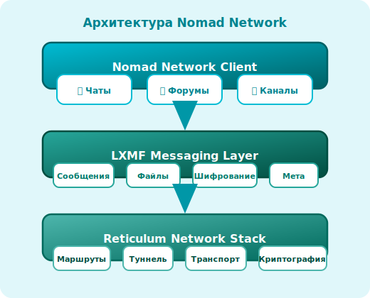
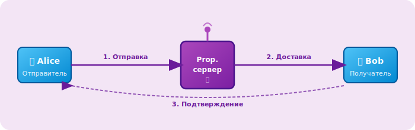
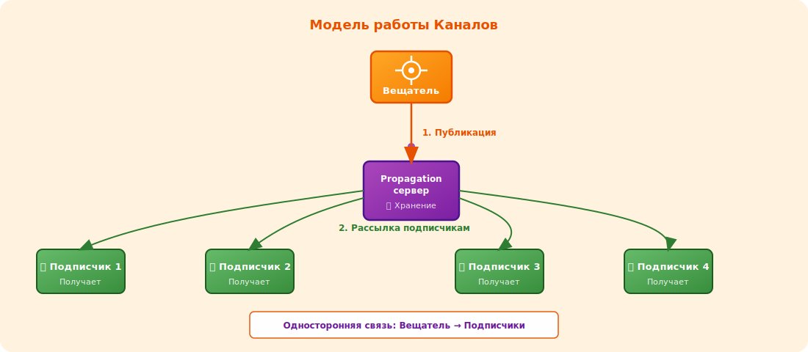
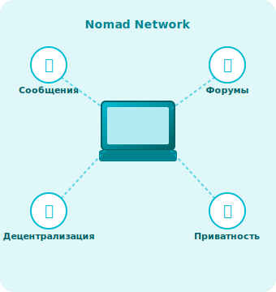
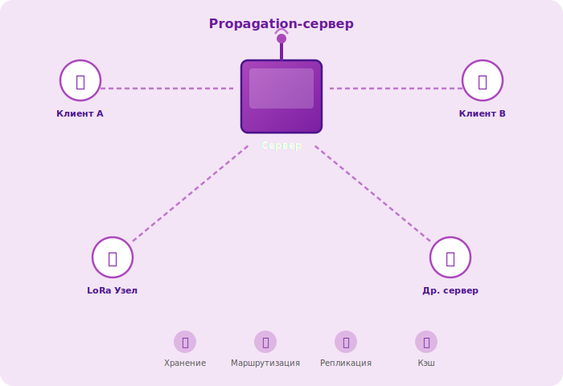

# Nomad Network

**Nomad Network** — это децентрализованный клиент для общения, работающий поверх LXMF и Reticulum. Он предоставляет возможности для обмена сообщениями, участия в форумах и подписки на каналы — всё это без центрального сервера, цензуры и сбора данных.

---

## Архитектура

Nomad Network построен на трёх уровнях стека Reticulum:

<div class="diagram-center">
  <figure>
    
    <figcaption>Рисунок 1 — Многоуровневая архитектура Nomad Network</figcaption>
  </figure>
</div>

Каждый уровень инкапсулирует функциональность нижележащего, предоставляя пользователю единый интерфейс для децентрализованного общения.  


## Ключевые возможности

### 💬 Личные сообщения

Прямое общение между пользователями с использованием LXMF:

- **Сквозное шифрование** — сообщения доступны только отправителю и получателю
- **Асинхронная доставка** — сообщения хранятся в сети до получения адресатом
- **Подтверждения** — уведомления о доставке и прочтении
- **Вложения** — поддержка файлов и изображений

<div class="diagram-center">
  <figure>
    
    <figcaption>Рисунок 2 — Поток сообщений между клиентами через Propagation-сервер</figcaption>
  </figure>
</div>


### 📝 Форумы

Публичные пространства для обсуждений, работающие по принципу распределённой доски объявлений:

| Характеристика | Описание |
|----------------|----------|
| **Тематические разделы** | Форумы организуются по темам и категориям |
| **Модерация** | Создатель форума управляет доступом и контентом |
| **Репликация** | Сообщения распространяются между узлами сети |
| **Анонимность** | Публикация без привязки к реальной личности |

**Как работают форумы:**

1. Пользователь подключается к форуму по его идентификатору
2. Загружает последние сообщения из сети
3. Публикует новые сообщения, которые распространяются среди подписчиков
4. Сообщения кэшируются на узлах Propagation-серверов


### 📰 Каналы

Односторонние новостные ленты для распространения информации:

- **Подписка** — пользователи подписываются на интересующие каналы
- **Вещание** — владелец канала публикует обновления
- **Автообновление** — новые сообщения доставляются подписчикам автоматически
- **Примеры использования**: новостные ленты, блоги, уведомления сервисов

<div class="diagram-center">
  <figure>
    
    <figcaption>Рисунок 5 — Модель работы каналов: вещание от создателя к подписчикам через Propagation-сервер</figcaption>
  </figure>
</div>


### 🔐 Приватность и безопасность

<div class="grid cards" markdown>

-   **🔒 Сквозное шифрование**

    Все сообщения шифруются на устройстве отправителя и расшифровываются только на устройстве получателя

-   **🎭 Анонимность**

    Не требуется регистрация, email, телефон или любые персональные данные

-   **🌐 Децентрализация**

    Нет единого сервера или точки отказа — сеть работает на узлах пользователей

-   **🛡️ Криптография**

    Используется современная криптография (Curve25519, AES, SHA-256)

</div>


## Как это работает?

### Сетевая топология

Nomad Network работает в любой сетевой конфигурации:

<div class="diagram-center">
  <figure>
    
    <figcaption>Рисунок 3 — Пример сетевой топологии с различными транспортами</figcaption>
  </figure>
</div>

Все узлы равноправны и могут маршрутизировать трафик для других участников сети.  


### Propagation-серверы

Серверы распространения играют ключевую роль в доставке сообщений:

<div class="diagram-center">
  <figure>
    
    <figcaption>Рисунок 4 — Propagation-сервер и подключённые узлы</figcaption>
  </figure>
</div>

**Функции Propagation-серверов:**

- Хранение сообщений для офлайн-получателей
- Маршрутизация сообщений между узлами сети
- Репликация данных между серверами
- Кэширование часто запрашиваемых сообщений  

## Конфигурация

### Базовая настройка

Конфигурационный файл Nomad Network (`~/.nomadnetwork/config`):

```ini
[default]
# Идентификатор узла (генерируется автоматически)
private_key = <ваш_закрытый_ключ>

# Подключение к сети
enable_distribution_server = True
distribution_server_port = 9000

# Интерфейс
language = ru
editor = nano

# Безопасность
allow_unsigned_messages = False
max_message_size = 50KB
```

### Подключение к форумам

Для подключения к форуму добавьте его идентификатор в конфигурацию:

```ini
[forums]
# Формат: forum_name = lxmf_address
main_forum = <адрес_форума>
news = <адрес_новостного_форума>
```


### Интеграция с другими клиентами

Nomad Network совместим с другими LXMF-клиентами:

| Клиент | Совместимость |
|--------|---------------|
| **Sideband** | ✅ Полная — обмен сообщениями и файлами |
| **Columba** | ✅ Полная — обмен сообщениями |
| **MeshChat** | ✅ Частичная — текстовые сообщения |
| **Другие LXMF** | ✅ Базовая — через стандартный протокол |


## Использование

### Запуск клиента

```bash
# Запуск Nomad Network
nomadnet

# Запуск в фоновом режиме
nomadnet --daemon

# Проверка статуса
nomadnet --status
```

### Основные команды

| Команда | Описание |
|---------|----------|
| `/chat <address>` | Начать чат с указанным адресом |
| `/forum <name>` | Подключиться к форуму |
| `/channel <id>` | Подписаться на канал |
| `/send <address> <message>` | Отправить сообщение |
| `/list` | Показать список контактов и форумов |
| `/help` | Показать справку |


## Преимущества и ограничения

### ✅ Преимущества

- **Полная децентрализация** — нет зависимости от центральных серверов
- **Работа в офлайн-сетях** — функционирует без интернета
- **Устойчивость к цензуре** — сообщения невозможно заблокировать
- **Конфиденциальность** — никакой телеметрии и сбора данных
- **Кроссплатформенность** — работает на Linux, macOS, Windows, Android

### ⚠️ Ограничения

- **Скорость доставки** — зависит от доступности получателя в сети
- **Пропускная способность** — ограничена характеристиками транспортов (LoRa, WiFi)
- **Отсутствие веб-интерфейса** — только CLI и нативные клиенты
- **Требует настройки** — начальная конфигурация может быть сложной для новичков

---

## См. также

- [**Основы LXMF**](../lxmf/index.md) — протокол, на котором работает Nomad Network
- [**Утилиты LXMF**](../lxmf/tools/index.md) — инструменты для работы с сообщениями
- [**Основы RNS**](../rns/index.md) — сетевой стек Reticulum
- [**Утилиты RNS**](../rns/tools/index.md) — диагностика и управление сетью
