# Аппаратное обеспечение

Одно из ключевых преимуществ Reticulum — возможность работы практически через любую среду передачи данных. Типы интерфейсов, доступные для настройки в Reticulum, достаточно гибки для поддержки большинства проводных и беспроводных коммуникационных устройств: от старых пакетных радиомодемов до современных миллиметровых волновых систем магистральной связи.

Если у вас уже есть коммуникационное оборудование, велика вероятность, что оно будет работать с Reticulum из коробки. В случае несовместимости можно создать необходимый адаптер с минимальными усилиями, используя, например, `PipeInterface` или `TCPClientInterface` в сочетании с таким ПО, как [TCP KISS Server](https://github.com/markqvist/tcpkiss).

Также легко писать и загружать собственные модули интерфейсов в Reticulum, позволяя взаимодействовать практически с любым устройством.

Несмотря на такую широкую поддержку и гибкость, обилие опций может затруднить начало работы, особенно если вы начинаете с нуля.

В этой главе будут рассмотрены несколько разумных стартовых вариантов для развёртывания функциональной беспроводной связи с минимальными затратами и усилиями. Будут охвачены две основные категории устройств: **RNodes** и **WiFi-радиостанции**. Также кратко будут описаны другие распространённые варианты.

Знание того, как использовать несколько различных типов оборудования, позволит строить широкий спектр полезных сетей с минимальными усилиями.

## Комбинирование типов оборудования

При проектировании сети полезно комбинировать различные типы каналов и оборудования. Один из полезных паттернов — использовать высокопропускные точка-точка линки на основе WiFi или миллиметровых волновых радиостанций (с направленными антеннами высокого усиления) для магистральной сети, и RNodes на базе LoRa для покрытия больших зон связью для клиентских устройств.

---

## RNode

Надёжные и универсальные дальнобойные цифровые радиоприёмнопередающие системы обычно либо очень дороги, либо сложны в настройке и эксплуатации, либо их трудно достать, либо они энергоёмки, либо всё сразу. Чтобы исправить эту ситуацию, была разработана трансиверная система **RNode**.

Важно отметить: **RNode** — это не конкретное устройство от одного производителя, а открытая платформа, которую любой может использовать для создания интероперабельных цифровых трансиверов, подходящих для его нужд и конкретных ситуаций.

**RNode** — это универсальный, интероперабельный, энергоэффективный и дальнобойный, надёжный, открытый и гибкий радиокоммуникационный модуль. В зависимости от компонентов он может работать на различных частотных диапазонах и использовать различные схемы модуляции, но чаще всего (и для целей этой главы) мы ограничимся обсуждением RNodes, использующих модуляцию **LoRa** в распространённых ISM-диапазонах.

> ⚠️ **Не путайте!** RNodes могут использовать LoRa как модуляцию физического уровня, но **не имеют ничего общего** с протоколом и стандартом **LoRaWAN**, используемым для централизованно управляемых IoT-устройств. RNodes используют «сырую» LoRa-модуляцию без какого-либо дополнительного протокольного оверхеда. Вся высокоуровневая протокольная функциональность обрабатывается непосредственно Reticulum.

### Создание RNodes

RNode разработан как система, лёгкая для воспроизводства во времени и пространстве. Вы можете собрать работающий трансивер из общедоступных компонентов и нескольких инструментов с открытым исходным кодом. Хотя можно проектировать и строить RNodes полностью с нуля под ваши точные требования, в этой главе будет объяснён простейший подход к созданию RNodes: **использование распространённых LoRa-плат разработки**.

Этот подход сводится к двум простым шагам:

1. Приобрести одну или несколько поддерживаемых плат разработки
2. Установить прошивку RNode с помощью автоматического установщика

После установки и настройки прошивки скриптом она готова к использованию с любым ПО, поддерживающим RNodes, включая Reticulum. Устройство можно использовать с Reticulum, добавив `RNodeInterface` в конфигурацию.

### Поддерживаемые платы и устройства

Для создания RNodes вам потребуется приобрести поддерживаемые платы разработки или готовые устройства. Следующие платы и устройства поддерживаются автоматическим установщиком:

<div class="grid hardware-grid" markdown>

<div class="card" markdown>
[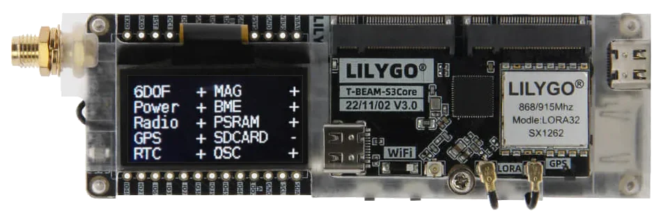{ loading=lazy }](../assets/img/boards/board_tbeam_supreme.png){ class="glightbox" }

**LilyGO T-Beam Supreme**

- **Трансивер IC:** Semtech SX1262 или SX1268
- **Платформа:** ESP32
- **Производитель:** LilyGO
- **Особенности:** Встроенный GPS, дисплей, слот для аккумулятора. Подходит для мобильных и портативных устройств.
</div>

---

<div class="card" markdown>
[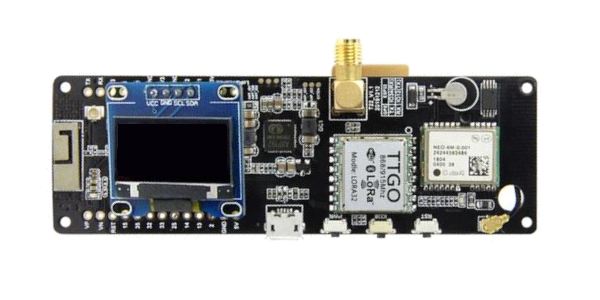{ loading=lazy }](../assets/img/boards/board_tbeam.png){ class="glightbox" }

**LilyGO T-Beam**

- **Трансивер IC:** Semtech SX1262, SX1268, SX1276 или SX1278
- **Платформа:** ESP32
- **Производитель:** LilyGO
- **Особенности:** Встроенный GPS, OLED-дисплей, держатель аккумулятора 18650. Популярный выбор для портативных станций.
</div>

---

<div class="card" markdown>
[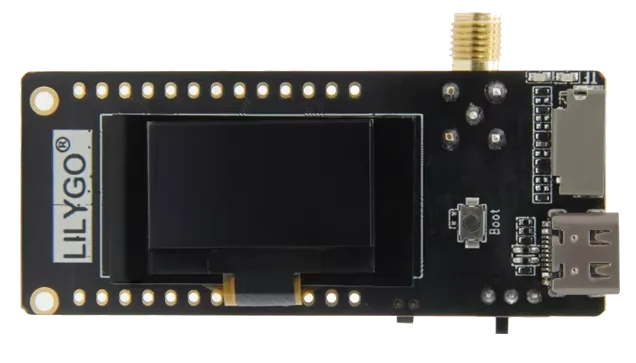{ loading=lazy }](../assets/img/boards/board_t3s3.png){ class="glightbox" }

**LilyGO T3S3**

- **Трансивер IC:** Semtech SX1262, SX1268, SX1276 или SX1278
- **Платформа:** ESP32
- **Производитель:** LilyGO
- **Особенности:** Компактная плата с USB-C, подходит для стационарных и портативных решений.
</div>

---

<div class="card" markdown>
[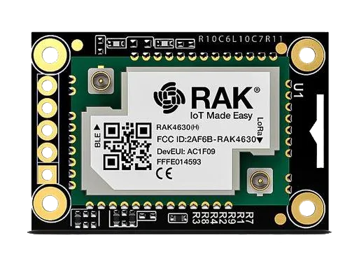{ loading=lazy }](../assets/img/boards/board_rak4631.png){ class="glightbox" }

**RAK4631-based Boards**

- **Трансивер IC:** Semtech SX1262 или SX1268
- **Платформа:** nRF52
- **Производитель:** RAK Wireless
- **Особенности:** Низкое энергопотребление, Bluetooth 5.0, подходит для батарейных устройств.
</div>

---

<div class="card" markdown>
[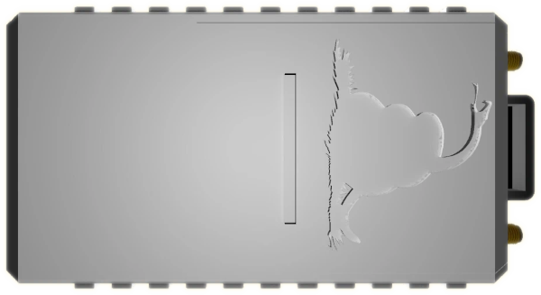{ loading=lazy }](../assets/img/boards/board_opencomxl.png){ class="glightbox" }

**OpenCom XL**

- **Трансивер ICs:** Semtech SX1262 и SX1280 (двойной трансивер)
- **Платформа:** nRF52
- **Производитель:** Liberated Embedded Systems
- **Особенности:** Двойной трансивер для одновременной работы на двух диапазонах, USB-C, встроенный зарядник.
</div>

---

<div class="card" markdown>
[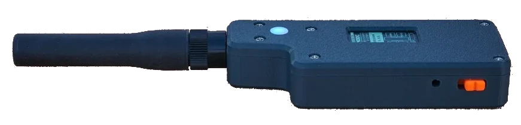{ loading=lazy }](../assets/img/boards/board_rnodev2.png){ class="glightbox" }

**Unsigned RNode v2.x**

- **Трансивер IC:** Semtech SX1276 или SX1278
- **Платформа:** ESP32
- **Производитель:** unsigned.io
- **Особенности:** Оригинальная плата RNode, оптимизирована для работы с Reticulum.
</div>

---

<div class="card" markdown>
[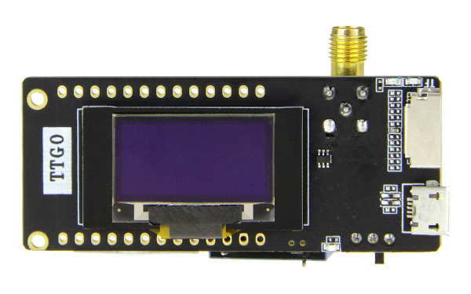{ loading=lazy }](../assets/img/boards/board_t3v21.png){ class="glightbox" }

**LilyGO LoRa32 v2.1**

- **Трансивер IC:** Semtech SX1276 или SX1278
- **Платформа:** ESP32
- **Производитель:** LilyGO
- **Особенности:** Компактная плата с OLED-дисплеем, популярна для начинающих.
</div>

---

<div class="card" markdown>
[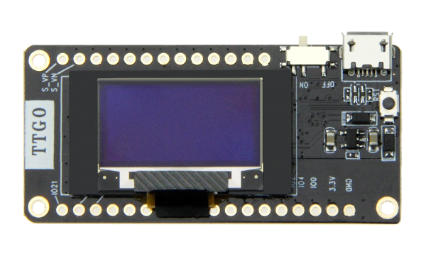{ loading=lazy }](../assets/img/boards/board_t3v20.png){ class="glightbox" }

**LilyGO LoRa32 v2.0**

- **Трансивер IC:** Semtech SX1276 или SX1278
- **Платформа:** ESP32
- **Производитель:** LilyGO
- **Особенности:** Предыдущая версия с OLED-дисплеем, широко доступна.
</div>

---

<div class="card" markdown>
[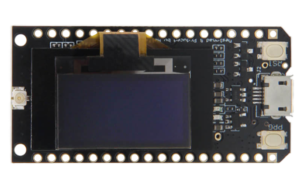{ loading=lazy }](../assets/img/boards/board_t3v10.png){ class="glightbox" }

**LilyGO LoRa32 v1.0**

- **Трансивер IC:** Semtech SX1276 или SX1278
- **Платформа:** ESP32
- **Производитель:** LilyGO
- **Особенности:** Первая версия серии LoRa32, базовая функциональность.
</div>

---

<div class="card" markdown>
[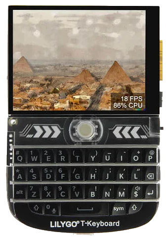{ loading=lazy }](../assets/img/boards/board_tdeck.png){ class="glightbox" }

**LilyGO T-Deck**

- **Трансивер IC:** Semtech SX1262 или SX1268
- **Платформа:** ESP32
- **Производитель:** LilyGO
- **Особенности:** Встроенная клавиатура, дисплей, слот для microSD. Идеально для портативных терминалов.
</div>

---

<div class="card" markdown>
[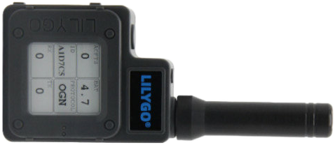{ loading=lazy }](../assets/img/boards/board_techo.png){ class="glightbox" }

**LilyGO T-Echo**

- **Трансивер IC:** Semtech SX1262 или SX1268
- **Платформа:** nRF52
- **Производитель:** LilyGO
- **Особенности:** Компактный форм-фактор, низкое энергопотребление, встроенный дисплей.
</div>

---

<div class="card" markdown>
[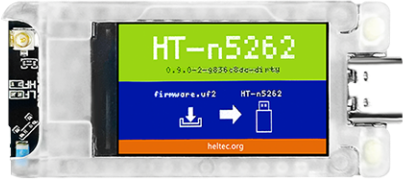{ loading=lazy }](../assets/img/boards/board_t114.png){ class="glightbox" }

**Heltec T114**

- **Трансивер IC:** Semtech SX1262 или SX1268
- **Платформа:** nRF52
- **Производитель:** Heltec Automation
- **Особенности:** Низкое энергопотребление, компактный размер, подходит для носимых устройств.
</div>

---

<div class="card" markdown>
[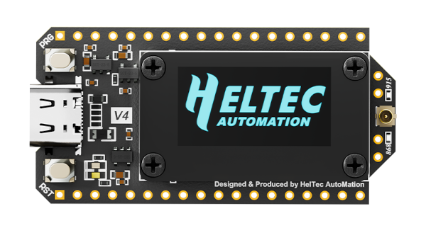{ loading=lazy }](../assets/img/boards/board_heltec32v4.png){ class="glightbox" }

**Heltec LoRa32 v4.0**

- **Трансивер IC:** Semtech SX1262
- **Платформа:** ESP32
- **Производитель:** Heltec Automation
- **Особенности:** Новейшая версия с улучшенной схемой питания, USB-C, OLED-дисплей.
</div>

---

<div class="card" markdown>
[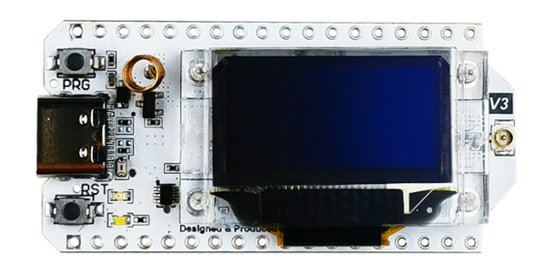{ loading=lazy }](../assets/img/boards/board_heltec32v30.png){ class="glightbox" }

**Heltec LoRa32 v3.0**

- **Трансивер IC:** Semtech SX1262 или SX1268
- **Платформа:** ESP32
- **Производитель:** Heltec Automation
- **Особенности:** Улучшенная версия с USB-C, OLED-дисплей, встроенный зарядник аккумулятора.
</div>

---

<div class="card" markdown>
[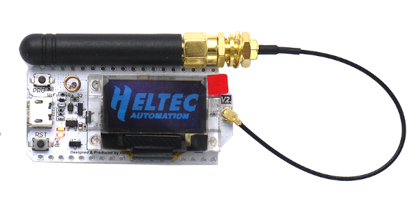{ loading=lazy }](../assets/img/boards/board_heltec32v20.png){ class="glightbox" }

**Heltec LoRa32 v2.0**

- **Трансивер IC:** Semtech SX1276 или SX1278
- **Платформа:** ESP32
- **Производитель:** Heltec Automation
- **Особенности:** Классическая плата с OLED-дисплеем, широко используется в проектах LoRa.
</div>

</div>

### Установка

После получения совместимых плат можно установить прошивку RNode с помощью **RNode Configuration Utility**. Если вы установили Reticulum в свою систему, программа `rnodeconf` уже будет доступна. Если нет, убедитесь, что Python3 и pip установлены в вашей системе, затем установите Reticulum через pip:

```bash
pip install rns
```

После завершения установки можно приступать к установке прошивки на устройства. Запустите `rnodeconf` в режиме автоустановки:

```bash
rnodeconf --autoinstall
```

Утилита проведёт вас через процесс установки, задав ряд вопросов о вашем оборудовании. Просто следуйте инструкциям, и утилита автоматически установит и настроит ваши устройства.

### Использование с Reticulum

Когда устройства установлены и настроены, их можно использовать с Reticulum, добавив соответствующую секцию интерфейса в конфигурационный файл Reticulum. В конфигурации можно указать все параметры интерфейса, такие как последовательный порт и параметры эфира.

---

## WiFi-оборудование

С Reticulum можно использовать все виды коротко- и дальнобойного WiFi-оборудования. Любое оборудование, полностью поддерживающее мостовой Ethernet через WiFi-интерфейс, будет работать с `AutoInterface` в Reticulum. Большинство устройств ведут себя так по умолчанию или позволяют это через конфигурационные опции.

Это означает, что можно просто настроить физические линки WiFi-устройств и начать обмен данными через них с помощью Reticulum. Нет необходимости включать IP-инфраструктуру, такую как DHCP-серверы, DNS и подобное, пока доступен хотя бы Ethernet и пакеты передаются прозрачно через физические WiFi-устройства.

Ниже приведён список примеров WiFi (и подобных) радиостанций, которые хорошо подходят для высокопропускных линков Reticulum на большие расстояния:

<div class="grid hardware-grid" markdown>

<div class="card" markdown>
[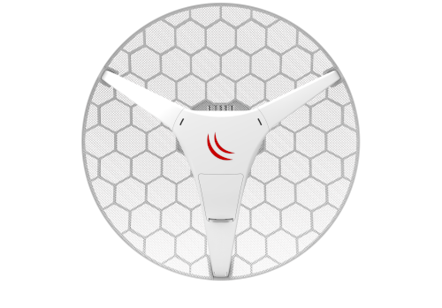{ loading=lazy }](../assets/img/radio/radio_rblhg5.png){ class="glightbox" }

**Ubiquiti RocketBase LHG 5**

- **Тип:** Высокопропускная радиостанция для магистральных линков
- **Диапазон:** 5 ГГц
- **Особенности:** Направленная антенна высокого усиления, дальность до 15+ км, пропускная способность до 400+ Мбит/с. Идеально для backbone-соединений.
</div>

---

<div class="card" markdown>
[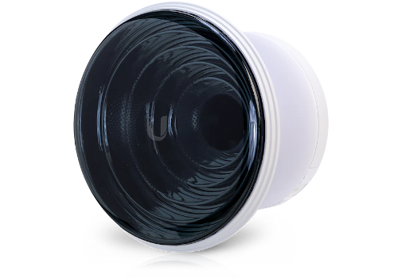{ loading=lazy }](../assets/img/radio/radio_is5ac.png){ class="glightbox" }

**Ubiquiti IsoStation 5AC**

- **Тип:** Направленная радиостанция для point-to-point соединений
- **Диапазон:** 5 ГГц
- **Особенности:** Встроенный изолятор, защита от помех, дальность до 10+ км. Подходит для городских условий.
</div>

</div>

Другие совместимые радиостанции:

- **Ubiquiti airMAX** радиостанции
- **Ubiquiti LTU** радиостанции
- **MikroTik** радиостанции

Этот список далеко не исчерпывающий и служит лишь несколькими примерами радиооборудования, которое относительно дёшево и при этом обеспечивает большую дальность и высокую пропускную способность для сетей Reticulum. Как и во всех других случаях, Reticulum может сосуществовать с IP-сетями, работающими параллельно на таких устройствах.

---

## Ethernet-оборудование

Reticulum может работать через любую среду, обеспечивающую коммутируемый Ethernet. Это означает, что можно использовать что угодно: от обычного Ethernet-коммутатора до волоконно-оптических систем и радиомодемов с Ethernet-интерфейсами.

Ethernet-среда не требует IP-инфраструктуры, такой как DHCP-серверы или маршрутизация, но в случае её существования Reticulum будет просто сосуществовать с ней.

Для использования Reticulum через Ethernet-среды обычно достаточно использовать встроенный `AutoInterface`. Этот интерфейс также работает через любые виды виртуальных сетевых адаптеров, таких как `tun` и `tap` устройства в Linux.

---

## Последовательные линии и устройства

Использование Reticulum через любую «сырую» последовательную линию также возможно с помощью `SerialInterface`. Этот тип интерфейса также полезен для использования Reticulum через коммуникационное оборудование, предоставляющее интерфейс последовательного порта.

---

## Пакетные радиомодемы

Любой пакетный радиомодем, предоставляющий стандартный KISS-интерфейс через USB, последовательный порт или TCP, можно использовать с Reticulum. Это включает виртуальные программные модемы, такие как **FreeDV TNC** и **Dire Wolf**.

---

## См. также

- [**Настройка RNode**](tools/rnodeconf.md) — утилита конфигурирования RNode
- [**Словарь терминов**](glossary.md) — справочник основных понятий RNS
- [**Основы RNS**](index.md) — введение в сетевой стек Reticulum
