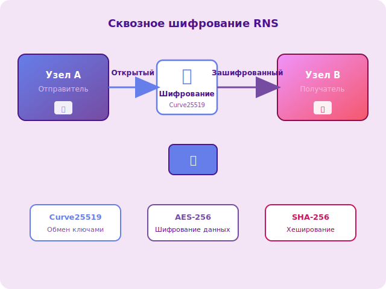
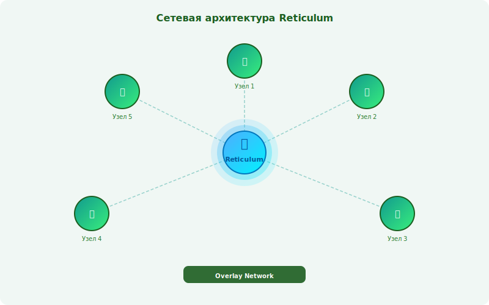
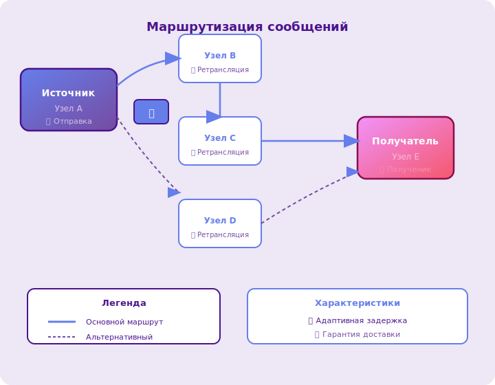

# Reticulum Network Stack (RNS)

**Reticulum Network Stack (RNS)** — это криптографически защищённый сетевой стек для построения оверлейных mesh-сетей любой топологии. Это не готовое приложение, а **протокол**, который можно использовать как фундамент для создания собственных решений: чатов, файлообменников, удалённых терминалов, веб-сервисов и других сетевых приложений.

---

## Архитектура

Reticulum создаёт **оверлейную сеть** поверх существующих физических каналов связи. Каждый узел в сети имеет уникальный криптографический идентификатор, а сообщения маршрутизируются между узлами с гарантией доставки и целостности данных.

<div class="diagram-center">
  <figure>
    
    <figcaption>Рисунок 1 — Оверлейная сеть Reticulum поверх различных транспортов</figcaption>
  </figure>
</div>

---

## Ключевые возможности

### 🔌 Независимость от транспорта

Reticulum работает поверх любого канала связи:

| Транспорт | Описание | Примеры использования |
|-----------|----------|----------------------|
| **TCP/IP** | Стандартные сетевые соединения | Интернет, локальные сети |
| **LoRa** | Дальнодействующая радиосвязь | Mesh-сети на большие расстояния |
| **WiFi** | Беспроводные сети | Прямое соединение устройств |
| **Serial** | Последовательные порты | Подключение радиомодемов |
| **Лазер** | Оптическая связь | Прямая видимость между узлами |
| **I2P** | Анонимная сеть | Скрытые соединения |

**Как это работает:**

1. Reticulum абстрагирует физический уровень связи
2. Приложение использует единый API независимо от транспорта
3. Сеть автоматически выбирает доступные каналы

---

### 🔐 Сквозное шифрование

Все соединения защищены по умолчанию:

- **Автоматическое шифрование** — не требуется дополнительной настройки
- **Современная криптография** — Curve25519, AES, SHA-256
- **Идентификация узлов** — каждый узел имеет криптографический идентификатор
- **Защита от прослушивания** — сообщения недоступны третьим лицам

<div class="diagram-center">
  <figure>
    
    <figcaption>Рисунок 2 — Схема сквозного шифрования между узлами</figcaption>
  </figure>
</div>

---

### 🌐 Самоорганизация сети

Узлы автоматически обнаруживают друг друга и строят маршруты:

| Характеристика | Описание |
|----------------|----------|
| **Отсутствие центрального сервера** | Нет зависимости от единой точки отказа |
| **Динамическая маршрутизация** | Маршруты адаптируются к изменениям топологии |
| **Обнаружение соседей** | Узлы находят друг друга автоматически |
| **Ретрансляция** | Узлы могут маршрутизировать трафик для других |

**Принцип работы:**

1. Узел объявляет о своём присутствии в сети
2. Соседние узлы обнаруживают его и устанавливают соединение
3. Информация о маршрутах распространяется по сети
4. При изменении топологии маршруты перестраиваются

---

### 🛠️ Универсальность

Поверх RNS можно запускать любые приложения:

<div class="grid cards" markdown>

-   **💬 Обмен сообщениями**

    LXMF, Nomad Network, Sideband — децентрализованные мессенджеры

-   **📁 Файлообмен**

    Передача файлов между узлами через утилиту `rncp`

-   **🖥️ Удалённый доступ**

    Выполнение команд на других узлах через `rnx`

-   **🌍 Веб-сервисы**

    HTTP-серверы и другие сетевые службы поверх RNS

</div>

---

## Как это работает?

### Сетевая архитектура

Reticulum работает поверх любой физической топологии сети, создавая единую оверлей-сеть.

<div class="diagram-center">
  <figure>
    
    <figcaption>Рисунок 3 — Сетевая архитектура Reticulum</figcaption>
  </figure>
</div>

**Ключевые принципы:**

- **Оверлей-сеть** — логический уровень поверх физических соединений
- **Транспортная независимость** — работа через LoRa, WiFi, Ethernet, Serial и другие интерфейсы
- **Единое адресное пространство** — сквозная идентификация узлов независимо от транспорта

---

### Маршрутизация

Reticulum использует адаптивную маршрутизацию:

<div class="diagram-center">
  <figure>
    
    <figcaption>Рисунок 4 — Маршрутизация сообщений между узлами</figcaption>
  </figure>
</div>

**Функции маршрутизации:**

- Поиск оптимального пути между узлами
- Адаптация к изменениям в топологии сети
- Ретрансляция сообщений через промежуточные узлы
- Гарантия доставки с подтверждением

---

## Конфигурация

### Базовая настройка

Конфигурационный файл Reticulum (`~/.reticulum/config`):

```ini
[default]
# Идентификатор узла (генерируется автоматически)
private_key = <ваш_закрытый_ключ>

# Транспортные интерфейсы
enable_tcp = True
tcp_port = 4242

enable_lora = True
lora_device = /dev/ttyUSB0
lora_frequency = 868000000

# Безопасность
allow_unsigned_messages = False
max_packet_size = 500
```

### Добавление интерфейсов

Для подключения нового транспорта добавьте секцию в конфигурацию:

```ini
[interfaces]
# TCP-интерфейс
[[tcp_interface]]
port = 4242
host = 0.0.0.0

# LoRa-интерфейс
[[lora_interface]]
device = /dev/ttyUSB0
frequency = 868000000
bandwidth = 125000
```

---

### Интеграция с приложениями

Reticulum предоставляет API для различных языков программирования:

| Язык | Статус | Документация |
|------|--------|--------------|
| **Python** | ✅ Полная | [reticulumnetworkstack.org](https://reticulumnetworkstack.org) |
| **JavaScript** | ✅ Полная | [JS SDK](https://github.com/markqvist/Reticulum.js) |
| **Rust** | ✅ Полная | [rust-rns](https://github.com/ArcadeRenegade/rust-rns) |
| **Go** | 🟡 Частичная | [go-rns](https://github.com/Alberici/go-rns) |

---

## Инструменты RNS

После изучения основ перейдите к практическим утилитам:

| Утилита | Назначение |
|---------|------------|
| [`rnsd`](tools/rnsd.md) | Демон Reticulum — фоновая служба для работы сети |
| [`rnstatus`](tools/rnstatus.md) | Просмотр статуса сети и подключений |
| [`rnid`](tools/rnid.md) | Генерация и управление идентификаторами |
| [`rnpath`](tools/rnpath.md) | Диагностика маршрутов между узлами |
| [`rnprobe`](tools/rnprobe.md) | Проверка доступности узлов и каналов |
| [`rncp`](tools/rncp.md) | Копирование файлов через сеть Reticulum |
| [`rnx`](tools/rnx.md) | Удалённое выполнение команд на других узлах |
| [`rnodeconf`](tools/rnodeconf.md) | Настройка TNC и радиомодемов RNode |

---

## Использование

### Запуск демона

```bash
# Запуск rnsd
rnsd

# Запуск в фоновом режиме
rnsd --daemon

# Проверка статуса
rnstatus
```

### Основные команды

| Команда | Описание |
|---------|----------|
| `rnid` | Сгенерировать новый идентификатор |
| `rnpath <destination>` | Найти маршрут до узла |
| `rnprobe <destination>` | Проверить доступность узла |
| `rncp <file> <destination>` | Копировать файл на удалённый узел |
| `rnx <destination> <command>` | Выполнить команду на удалённом узле |

---

## Преимущества и ограничения

### ✅ Преимущества

- **Полная децентрализация** — нет зависимости от центральных серверов
- **Работа в офлайн-сетях** — функционирует без интернета
- **Устойчивость к цензуре** — сообщения невозможно заблокировать
- **Конфиденциальность** — сквозное шифрование по умолчанию
- **Кроссплатформенность** — работает на Linux, macOS, Windows, Android
- **Гибкость** — поддержка любых транспортов и топологий

### ⚠️ Ограничения

- **Скорость передачи** — зависит от характеристик транспортов (LoRa ~0.5-5 Kbps)
- **Задержки** — могут быть значительными в многоскачковых mesh-сетях
- **Пропускная способность** — ограничена для файловых передач
- **Требует настройки** — начальная конфигурация может быть сложной для новичков

---

## См. также

- [**Словарь терминов**](glossary.md) — справочник основных понятий RNS
- [**Утилиты RNS**](tools/index.md) — инструменты для работы с сетью
- [**Основы LXMF**](../lxmf/index.md) — протокол обмена сообщениями поверх RNS
- [**Nomad Network**](../nomadnet/index.md) — децентрализованный клиент для общения
